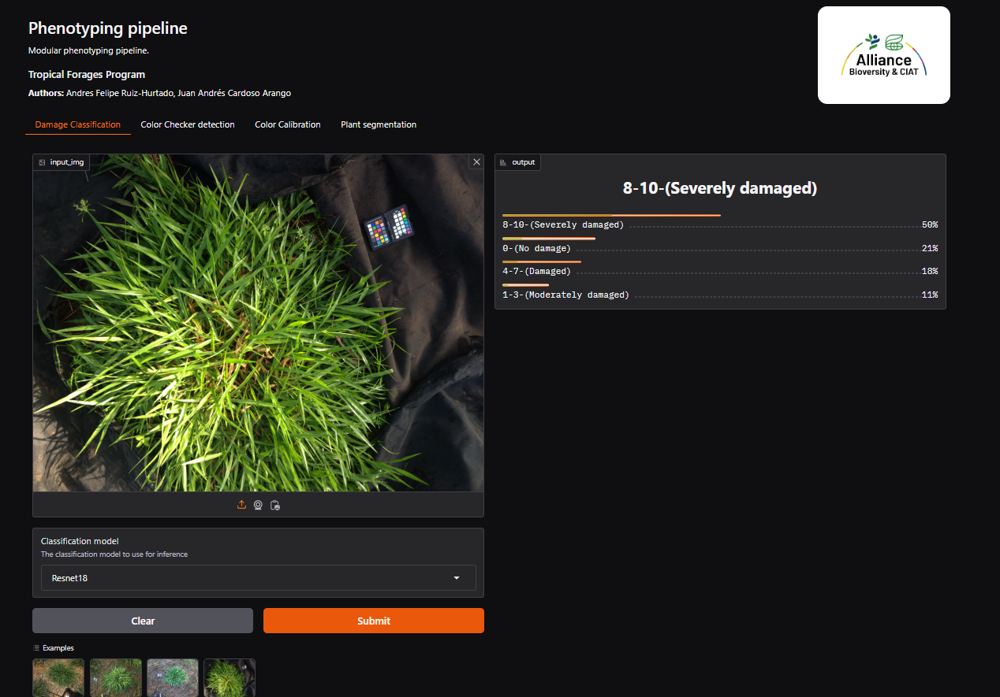

# damage_assessment_pipeline
AI-powered tool for spidermite damage assessment in tropical grasses




## Overview
The **damage_assessment_pipeline** is the initial version of an AI-powered tool designed for assessing spidermite damage in tropical grasses. This software uses advanced image processing and machine learning models to perform damage classification for field images and plant segmentation using a salient object detection approach. Further refinement of models and fine-tuning is being actively researched. A deployed Gradio web application version is available on Hugging Face for online use, and users can also run the tool locally.

## Features
- **AI-powered assessment**: Analyze images for spidermite damage (classification and plant segmentation).
- **Web application**: Use the tool directly through a Gradio web app on Hugging Face.
- **Local execution**: Run the tool locally for offline use.


## Getting Started

### 1. Online Usage (Gradio Web App)
Access the deployed web app on Hugging Face:
[**Damage Assessment Web App**](https://huggingface.co/spaces/anfruizhu/phenotyping_pipeline)

### 2. Local Execution

#### Prerequisites
- Python 3.8 or higher
- Git

### Dependencies
This project uses models and code from [**https://github.com/xuebinqin/U-2-Net**](https://huggingface.co/spaces/anfruizhu/phenotyping_pipeline)

#### Steps
1. Clone the repository:
   ```bash
   git clone https://github.com/afruizh/damage_assessment_pipeline
   cd damage_assessment_pipeline/webapp
   ```
2. Install dependencies:
   ```bash
   pip install -r requirements.txt
   ```
3. Run the tool locally:
   ```bash
   python main.py
   ```
4. Open your browser and navigate to `http://localhost:7860` to access the app.

## License
This project is licensed under the Apache-2.0 license.

## Authors
Tropical Forages Team

Alliance Bioversity International & CIAT